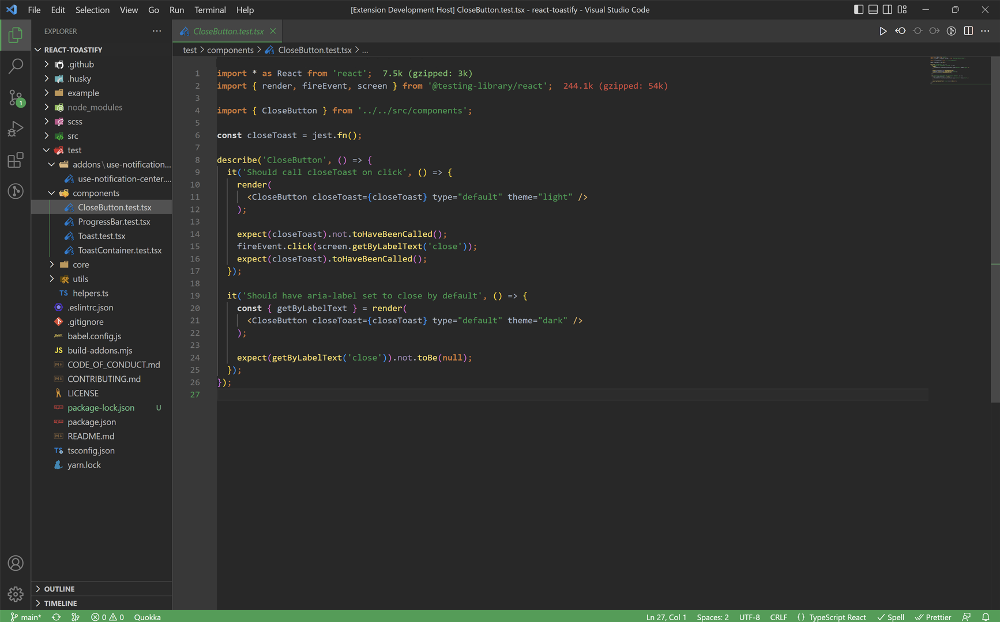
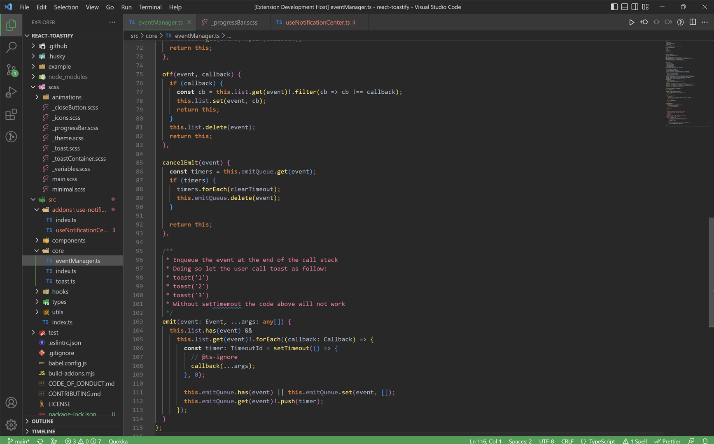
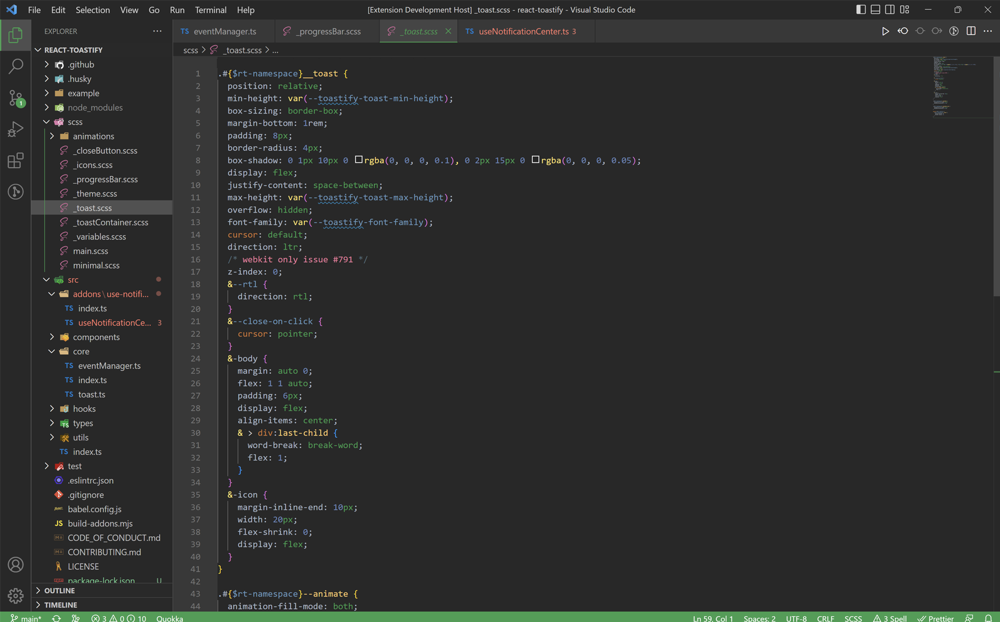

# Dark Symphony Theme

Introducing the 'Dark Symphony' theme for VS Code, a professional and visually pleasing theme designed to enhance your coding experience. This theme features warm, eye-pleasing colors that create a cozy and inviting atmosphere, while also providing a high level of readability and contrast to improve your focus and productivity. The color palette is carefully crafted to provide optimal contrast between different code elements, making it easy to navigate and understand your code. Whether you're working on a professional project or just enjoying a hobby, 'Dark Symphony' theme will elevate your coding experience to the next level.

## Theme preview

## Author

- [@codrinbulgariu - Github](https://github.com/codrinbulgariu)
- [@codrinbulgariu - LinkedIn](https://www.linkedin.com/in/bulgariucodrin)

## License

[MIT License (MIT)](./LICENSE)
